# Projeto `Uma análise sobre a quantidade de notificações por intoxicação com medicamentos`
# Project `An analysis of the number of notifications for drug intoxication`

# Apresentação

O presente projeto foi originado no contexto das atividades da disciplina de pós-graduação [*Ciência e Visualização de Dados em Saúde*](https://github.com/datasci4health/home), oferecida no primeiro semestre de 2021, na Unicamp. Segue a relação dos integrantes do grupo e respectivas áreas de especialização.

|Nome  | RA | Especialização|
|--|--|--|
| Alline Dias de Araujo  | 234988  | Computação|
| Bernardo do Amaral Teodosio  | 167494  | Computação|
| Marcelo Gorri Mazzali  | 107551  | Saúde|
| Moníze Valéria Ramos da Silva  | 184731  | Saúde|
| Rodolfo Dalla Costa  | 228956  | Computação|

# Descrição Resumida do Projeto
Na segunda década do século XXI foi possível perceber um aumento substancial no número de casos notificados de intoxicação por medicamentos, perfazendo a marca de 500.000 casos de intoxicações no SINAN. Tais dados apontam para uma maior incidência de casos de intoxicação medicamentosa do que por agrotóxicos, conforme pesquisa feita pelo grupo na mencionada base de dados. O achado em questão é coerente com o que vem sendo observado por órgãos como a Organização das Nações Unidas, por exemplo. Tratam-se de previsões sombrias e alarmantes que infelizmente são coerentes com os dados do estudo na população brasileira em 2019. Esta pesquisa de 2019 apontou ainda que as principais classes medicamentosas associadas à automedicação são: analgésicos e relaxantes musculares, com destaque para a dipirona como medicamento mais consumido nesse contexto. Além desse panorama, cabe destacar a grande variabilidade entre as cinco regiões brasileiras, tanto do ponto de vista socioeconômico quanto às notificações de intoxicações. Desta forma, o grupo se interessou em analisar estes tópicos, partindo desde análises dos perfis socioeconômicos e de faixa etária dos indivíduos afetados  das regiões brasileiras, procurando correlacionar os mesmos com a incidência de intoxicações medicamentosas. Para tanto, foram analisados dados presentes nas bases de dados públicas SINAN (Sistema Nacional de Agravos de Notificação) e IBGE, analisados com auxílio de ferramentas como o Power Bi, Orange e Collab. As análises realizadas apontaram para uma maior quantidade de notificações de intoxicação medicamentosa no estado do Paraná, após normalização pelo número estimado de habitantes. Além disso, foi possível notar uma correlação positiva entre número de notificações e renda, bem como uma maior quantidade de notificações em indivíduos adultos, quando comparado com outras faixas etárias mais extremas.
  
# Vídeos do Projeto

## Vídeo da Proposta
O vídeo da proposta do projeto pode ser encontrado no link a seguir: https://youtu.be/Dt77q7QpOvs

## Vídeo da Apresentação Final
O vídeo da apresentação final do projeto pode ser encontrado no link a seguir: https://youtu.be/2BDkJIeEiB4

# Slides do Projeto

## Slides da Proposta
Os slides da proposta original do projeto podem ser encontrados aqui: https://github.com/berteodosio/datascience4health/blob/master/assets/slides-proposta.pdf

## Slides da Apresentação Final
Os slides da apresentação final do projeto estão disponíveis em:
https://docs.google.com/presentation/d/e/2PACX-1vSbvtTkR4ttn-mb_54xGK2dKQIzksI9xq-47L0eMnpazRe4zRLiyh1QhYonAJVwe5-oEH6GwT53igcn/pub?start=false&loop=false&delayms=3000

# Introdução e Referenciais de Teóricos
No período compreendido entre 2010 e 2017, foram notificados mais de 500.000 casos de intoxicações no SINAN. Tais dados apontam para uma maior incidência de casos de intoxicação medicamentosa do que por agrotóxicos, conforme busca feita pelo grupo na mencionada base de dados. Simultaneamente, um estudo feito pelo Conselho Federal de Farmácia em 2019 mostrou que 77% da população brasileira se automedica [1], o que chamou a atenção para a questão da automedicação como possível fator capaz de levar a casos de intoxicação medicamentosa. Ainda neste contexto, a Organização Mundial da Saúde prevê que cerca de 10 milhões de óbitos sejam causados por automedicação por ano em 2050 [2]. Tratam-se de previsões sombrias e alarmantes que infelizmente são coerentes com os dados do estudo na população brasileira em 2019. Esta pesquisa de 2019 apontou ainda que as principais classes medicamentosas associadas à automedicação são: analgésicos e relaxantes musculares, com destaque para a dipirona como medicamento mais consumido nesse contexto. Além desse panorama, cabe destacar a grande variabilidade entre as cinco regiões brasileiras, tanto do ponto de vista socioeconômico quanto às notificações de intoxicações.

## Contextualização do projeto
Este trabalho foi realizado como projeto da disciplina "Ciência e Visualização de Dados em Saúde", oferecida no primeiro semestre de 2021 na UNICAMP. Dados os altos números de notificações por intoxicação nos últimos anos, optamos por realizar um estudo nesta área, com o objetivo de responder especialmente questões relacionadas à intoxicação por automedicação.

## Caracterização do problema
Nosso problema original consistia em responder perguntas de pesquisa relacionadas à quantidade de intoxicações medicamentosas nos últimos anos e, especialmente, intoxicações originárias a partir de automedicação. Infelizmente, por conta da falta de dados relativos à automedicação no Brasil, tivemos que alterar o rumo do nosso trabalho de forma a focar nas notificações por intoxicação de um modo geral - sem separação entre automedicação versus outros casos. Desta forma fizemos a relação de notificação de intoxicação do agente tóxico medicamento por região, comparando a renda mensal, número de leitos por hospital público e privado e o custo da internação assim como o tempo médio de internação.

## Motivação
Considerando todo o cenário crescente da disponibilidade de informações e o acesso facilitado a elas, além da perspectiva cada vez mais presente da disseminação de informações enganosas por redes sociais, um tema que sofreu uma disseminação indiscriminada com muita frequência nesses últimos anos é o da medicação e automedicação [3]. A constante repetição de informações infundadas sobre o uso das medicações sem nenhuma comprovação de eficácia, fez com que até mesmo, profissionais da saúde aderissem a algumas dessas idéias sem fundamentos [4,5]. Dessa maneira, tal impacto que estas informações causaram, tiveram como consequência a deterioração da saúde de pacientes que não apresentavam um estado grave, e o aumento de internações por pessoas que se automedicaram, baseado nessas informações disseminadas.

## Relevância
Dada a quantidade de notificações por intoxicação medicamentosa existentes nos últimos anos - mais de 530.000 apenas no SINAN - não é difícil concluir que tratamos de um assunto importante. A quantidade assombrosa de notificações associada à cultura do povo brasileiro de tomar remédios "por conta própria" [6] nos levou a realizar um estudo sobre este assunto, de forma a tentar encontrar respostas para as nossas perguntas iniciais e, possivelmente, contribuir para que o número de intoxicações possa vir a cair no futuro. Entendemos que, para que isso aconteça, são necessárias grandes alterações no modo de vida do brasileiro - incluindo alterações culturais, que não acontecem de um dia para o outro.

## Trabalhos relacionados
Os seguintes trabalhos publicados foram utilizados, em caráter complementar durante a análise dos dados, como forma de verificarmos se estávamos indo na direção certa:

- Ferreira, D. G. Intoxicação medicamentosa: aspectos relevantes da casuística de motivações suicidas. Repositório da Universidade Federal da Paraíba, 2014. Disponível em: https://repositorio.ufpb.br/jspui/handle/123456789/557
- Bortoletto, M. E. & Bochner, R. Impacto dos medicamentos nas intoxicações humanas no Brasil. Cad. Saúde Pública, 1999. Disponível em: https://www.scielosp.org/article/csp/1999.v15n4/859-869/pt/
- Alcântara, D. A., Vieira, J. E. S. & Albuquerque, V. L. M. Intoxicação Medicamentosa em Criança. Revista Brasileira da Promoção à Saúde, 2003. Disponível em: https://www.redalyc.org/pdf/408/40816203.pdf
- Silva, E. R. & Álvares, A. C. M. Intoxicação medicamentosa relacionada à tentativa de autoextermínio. REICEN - Revista de Iniciação Científica e Extensão 2019. Disponível em: https://revistasfacesa.senaaires.com.br/index.php/iniciacao-cientifica/article/view/154
- Margonato, F. B., Thomson, Z. & Paoliello, M. M. B. Determinantes nas intoxicações medicamentosas agudas na zona urbana de um município do Sul do Brasil. Cad. Saúde Pública, 2008. Disponível em: https://www.scielosp.org/article/ssm/content/raw/?resource_ssm_path=/media/assets/csp/v24n2/11.pdf
- Pereira, M. J. A. et al. Perfil dos casos notificados de intoxicação exógena por medicamentos no estado do Ceará, revista Multidisciplinar e de Psicologia, 2021. Disponível em:. https://idonline.emnuvens.com.br/id/article/view/2984

## Indicação (bastante resumida) da análise proposta
O perfil de intoxicação de medicamentos é bem alto especialmente emtrês principais estados: São Paulo, Minas Gerais e Paraná - onde apresentam uma renda per capita maior e com maior número populacional, assim como número de hospitais públicos e privados, prevalecendo maior acesso ao tratamento. Percebemos que as idades que mais notificam são entre 20 a 49 anos, pois também são as pessoas que mais tomam medicamentos sem o devido acompanhamento. Hipotetizamos  possíveis causas como: resultados de buscas pessoais e/ou indicações de amigos ou colegas.

## Indicação (bastante resumida) dos resultados alcançados
Conseguimos alcançar o objetivo inicial de verificar o nível de notificação por intoxicação por medicamento, fazer correlação entre a faixa etária que notifica e ainda a relação de reações adversas por estado, ficando claro que existe a mesma proporcionalidade das notificações do site SINAN. Não conseguimos atingir os objetivos iniciais de realizar análises em relação às notificações por automedicação e relacionar com a quantidade de publicidade existente para medicamentos, por falta de bases de dados que apresentem estes valores.

# Perguntas de Pesquisa
1. Qual a relação entre a quantidade de notificações por intoxicação e a quantidade de intoxicações por automedicação na população brasileira?
1. Qual a relação entre a quantidade de notificações de intoxicações por automedicação e o poder socioeconômico das regiões brasileiras?
1. Qual o perfil socioeconômico da população brasileira que realiza notificações sobre intoxicações epidemiológicas?

A Análise Exploratória contribuiu para que possamos nos aproximar das respostas das Perguntas de Pesquisa. Optamos por subdividir os resultados da Análise de acordo com as perguntas que a mesma ajuda a responder.

# Objetivos do Projeto
Na abordagem do problema apresentado, buscamos primariamente responder às perguntas de pesquisa através da execução de análises exploratórias em diferentes bases de dados. Além de analisar os dados destas bases, buscamos encontrar correlações entre as variáveis apresentadas de forma a poder observar resultados relevantes.

# Metodologia
No início do projeto, pretendíamos seguir a metodologia KDD para nos guiar no desenvolvimento do mesmo. Estávamos em dúvida principalmente entre o KDD e o CRISP-DM, mas optamos por seguir o primeiro por acreditarmos que o mesmo é mais apropriado para projetos de pesquisa - diferentemente do CRISP-DM, que tem maior adoção na indústria, conforme visto nas aulas da disciplina.

No entanto, durante o decorrer do projeto, acabamos por nos afastar da metodologia KDD e seguimos uma metodologia livre, não-específica. Alguns dos motivos que nos levaram a involuntariamente nos afastar do KDD foram, principalmente:

- Dificuldade em encontrar bases de dados para responder às nossas perguntas de pesquisas originais
- Necessidade de dar passos atrás e realizar alterações no objetivo do projeto, dadas as limitações das bases de dados encontradas

## Bases de Dados e Evolução

### Bases Estudadas mas Não Adotadas

|Base de Dados  | Endereço na Web | Resumo descritivo|
|--|--|--|
| SINITOX  | https://sinitox.icict.fiocruz.br/  | Base de dados mantida pela Fiocruz que contém dados de notificação de intoxicação|

Apesar da base ainda ser mantida pela Fiocruz, a mesma tem tido uma entrada cada vez menor de dados de notificações de intoxicação, o que acaba fazendo com que a base tenha uma tendência a não refletir a realidade tão bem. Por esta razão, optamos por não utilizá-la.

|Base de Dados  | Endereço na Web | Resumo descritivo|
|--|--|--|
| AEL / IBOPE  | https://www.ael.ifch.unicamp.br/ | Base de arquivos digitalizados provenientes de diversas fontes, incluindo o IBOPE|

Esta base não foi utilizada primariamente porque, após acessá-la, constatamos que seus dados estavam em forma de arquivos digitalizados - isto é, os dados presentes na mesma eram imagens de folhas de papel preenchidas. Sendo assim, não conseguiríamos extrair informações úteis ao nosso trabalho utilizando a mesma, e por isso optamos por não seguir adiante com análises em cima da mesma.

### Bases Estudadas e Adotadas

|Base de Dados  | Endereço na Web | Resumo descritivo|
|--|--|--|
| SINAN  | https://portalsinan.saude.gov.br/ | Base alimentada pela notificação e investigação de casos de doenças, a nível nacional|

A base, que faz parte do DATASUS, tem uma entrada de dados de notificações de intoxicação muito boa, possui diversas classificações, o que permite que seja possível comparar o tipo de intoxicação desejada por outros tipos, além de permitir o agrupamento dos dados por gênero, regionalidade, faixa etária e ser constantemente atualizada.

|Base de Dados  | Endereço na Web | Resumo descritivo|
|--|--|--|
| IBGE  | https://sidra.ibge.gov.br/tabela/6579 | Base de dados obtidos pelo Instituto Brasileiro de Geografia e Estatística, compreendendo desde dados de censos  e PNS.|

A base do IBGE exige uma busca pelo estudo estatístico adequado para que a base possa ser cruzada com os dados existentes, no entanto, a base do IBGE é quem fornece a fonte de dados mais completa a respeito das condições socioeconômicas por gênero, microrregiões, Unidade Federal, faixa etária e grau de escolaridade.

### Integração entre bases e Análise Exploratória

A análise exploratória foi realizada principalmente com o auxílio das ferramentas PowerBI e Orange. Optamos por dividir a análise em partes, segundo as Perguntas de Pesquisa que temos a pretensão de responder com o nosso projeto. Originalmente, nosso projeto possuía quatro perguntas de pesquisa - decidimos remover a última - "Qual o impacto das campanhas publicitárias na decisão dos brasileiros em se automedicar?" por não encontrarmos bases de dados com dados de campanhas publicitárias que poderíamos utilizar para cruzar com os dados que temos de intoxicação.

**Pergunta de pesquisa 1: Qual a relação entre a quantidade de notificações por intoxicação e a quantidade de intoxicações por automedicação na população brasileira?**

Não conseguimos relacionar nossos dados com quantidade por automedicação de maneira direta, pois não há base de dados sobre automedicação no Brasil, mas optamos que que a partir de 2007 até 2019 há um alto índice de intoxicação pelo “agente tóxico” medicamento, quando comparado aos demais agentes como drogas de abuso, defensivo agrícola, entre outros, conforme demonstrado pela relação abaixo por ano - o que sugere se tratar de casos de intoxicação medicamentosa. A **Figura 1** apresenta uma síntese das análises dos dados do SINAN associados às intoxicações.

**Figura 1**. Resultado quantitativo do levantamento de dados associados à intoxicação do SINAN.

  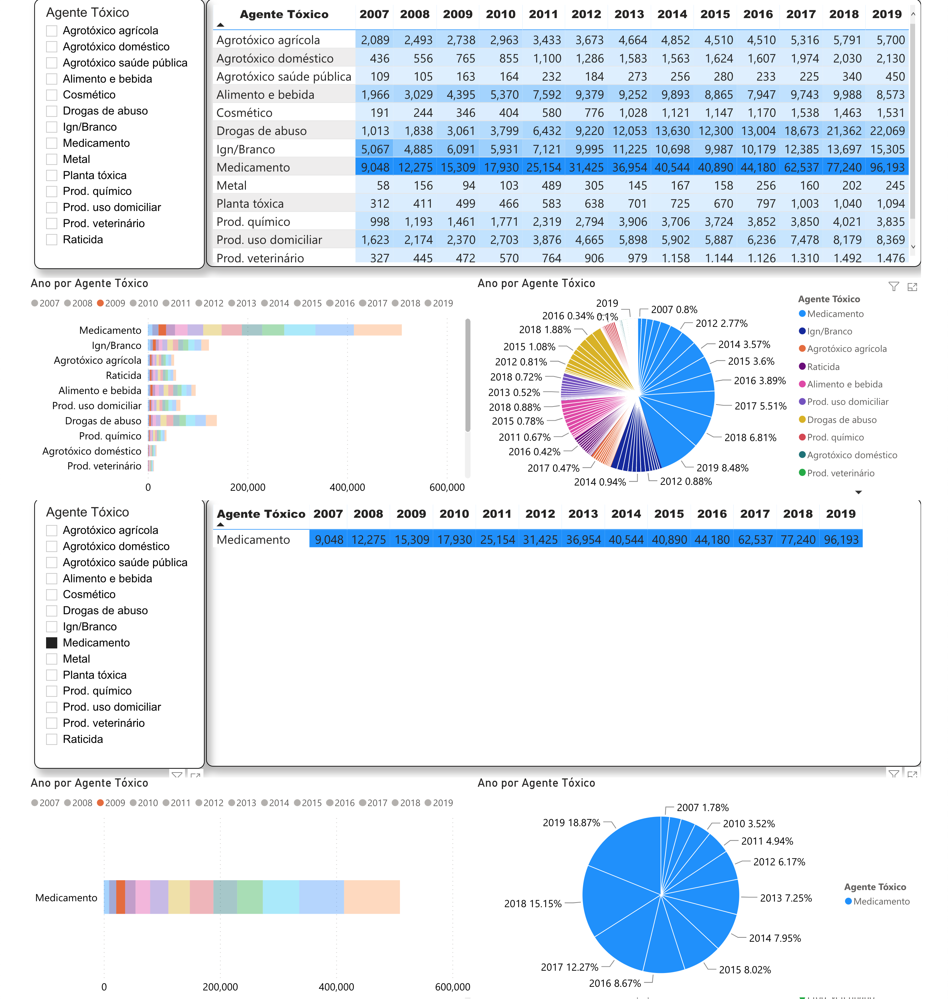

Através desta avaliação podemos concluir que o agente tóxico medicamento é o que mais vem sendo notificado em relação aos demais por ano e crescendo ano a ano desde 2007. Partindo destes resultados, realizamos uma segunda análise para verificar a procedência desse montante de notificações. Assim, verificamos que a maioria das notificações é proveniente dos estados de São Paulo, Minas Gerais e Paraná. Notamos ainda que, curiosamente, Pernambuco e Santa Catarina apresentam um índice de notificações bem próximas conforme é possível observar nos gráficos abaixo **(Figura 2)**:

**Figura 2**. Resultado da separação dos dados de intoxicação causadas por medicamento por Unidade Federativa

  

Outro ponto observado é que o aumento no número de notificações de intoxicação por uso de medicamento aumentou ao passar dos anos de maneira semelhante em todos os estados. O gráfico abaixo **(Figura 3)** mostra um exemplo com os estados: Rio de Janeiro, Rio Grande do Sul, Distrito Federal e Bahia.

**Figura 3**. Distribuição temporal das notificações de intoxicação por estado.

  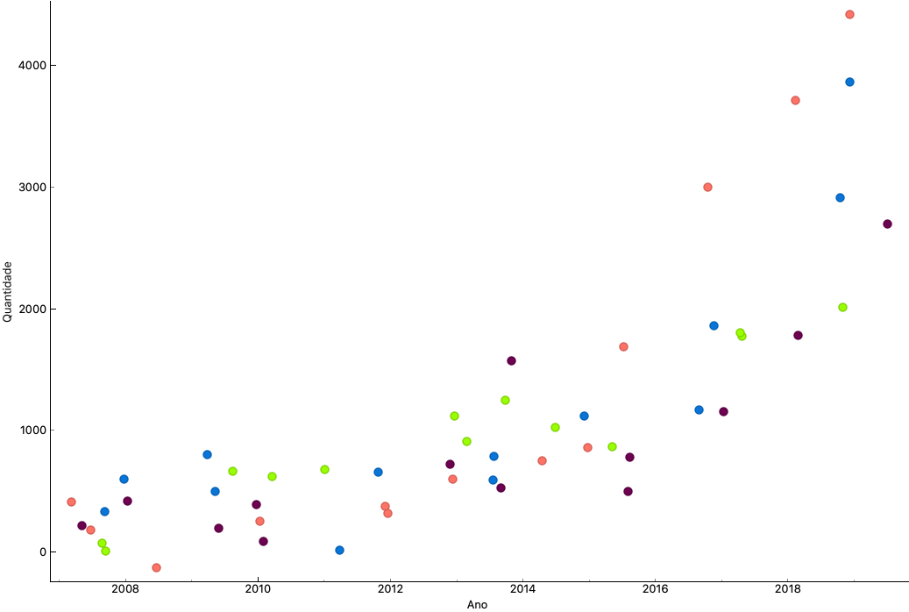

**Pergunta de pesquisa 2: Qual a relação entre a quantidade de notificações de intoxicações por automedicação e o poder socioeconômico das regiões brasileiras?**

Não foi possível avaliar por este critério de automedicação conforme justificado acima, mas agora podemos levantar outros questionamentos: por que três estados especificamente têm o maior índice de notificações? Existe alguma relação entre estes estados ou trata-se do mero acaso no caso de Pernambuco e Santa Catarina apresentarem dados próximos? A quantidade de hospitais por estado brasileiro e se possível a concentração dos mesmos em relação às regiões mais habitadas - estes números podem impactar grandemente nos resultados de nossas análises preliminares. Além disso, uma maior procura de pessoas para realizar notificações ou para dar entrada em hospitais por intoxicação devido a dificuldades de acesso em determinadas regiões também impactaria. Temos ainda questionamento sobre uma possível relação entre o que pretendemos cruzar com informações provenientes do IBGE e do site da Receita Federal relacionando a quantidade de hospitais, de forma a tentar encontrar padrões que ajudem a responder estes questionamento, bem como buscar por possíveis correlações de cunho sócio-econômico.
O gráfico abaixo **(Figura 4)** apresenta uma correlação moderada positiva entre a renda per capita dos estados e a quantidade de notificações para cada 100 mil habitantes. Para geração desse gráfico foram utilizados dados do IBGE sobre renda per capita nos estados, e projeção de habitantes no Brasil em 2019 [7]. 

**Figura 4**. Correlação entre renda per capita estadual e quantidade de notificações por 100 mil habitantes.

  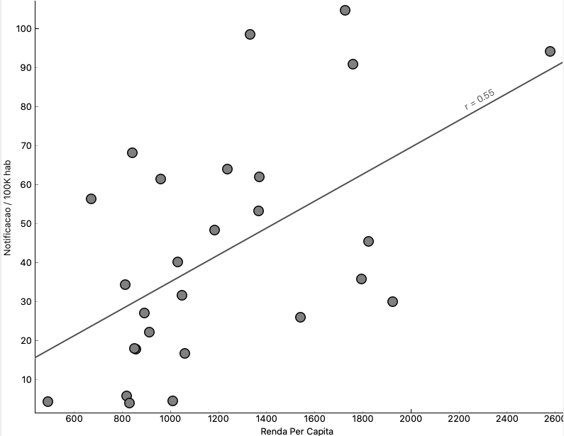

**Pergunta de pesquisa 3: Qual o perfil socioeconômico da população brasileira que realiza notificações sobre intoxicações epidemiológicas?**

No SINAN, não existe uma relação epidemiológica ligada diretamente à condição sócio econômica, mas podemos verificar pelo IBGE e por região quais as condições de renda e fazer uma correlação e verificar este fato. Salientamos que a análise em questão será realizada num próximo passo de avaliação de dados. Uma segunda etapa em relação a este perfil de análise seria fazer uma avaliação por faixa etária, onde já constatamos que há uma relação forte entre a faixa de 29 a 59 anos **(Figura 5)** como sujeitos das notificações levantadas.

**Figura 5**. Resultado da separação dos dados de intoxicação por medicamento de acordo com a faixa etária do sujeito da notificação.

  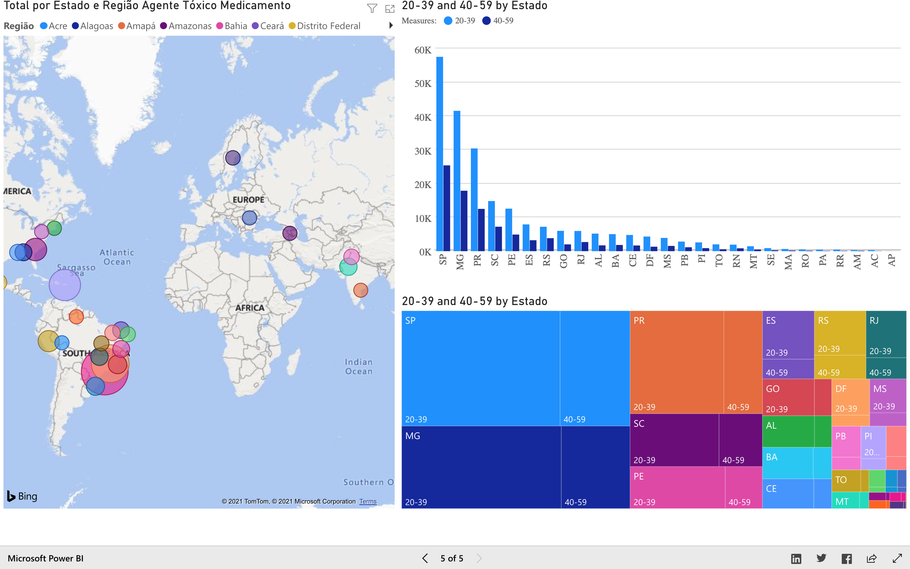

Como podemos notar nos gráficos gerados acima, estados com maior população como São Paulo e Minas Gerais possuem mais notificações de intoxicação. Para uma análise mais precisa verificamos a quantidade de notificações por habitantes. O gráfico abaixo **(Figura 6)** mostra esta relação com a quantidade de notificações para um grupo de 100 mil habitantes por estado. Os dados populacionais foram obtidos na projeção do IBGE para o ano de 2019.

**Figura 6**. Relação entre quantidade de notificações	 por 100 habitantes por estado.

  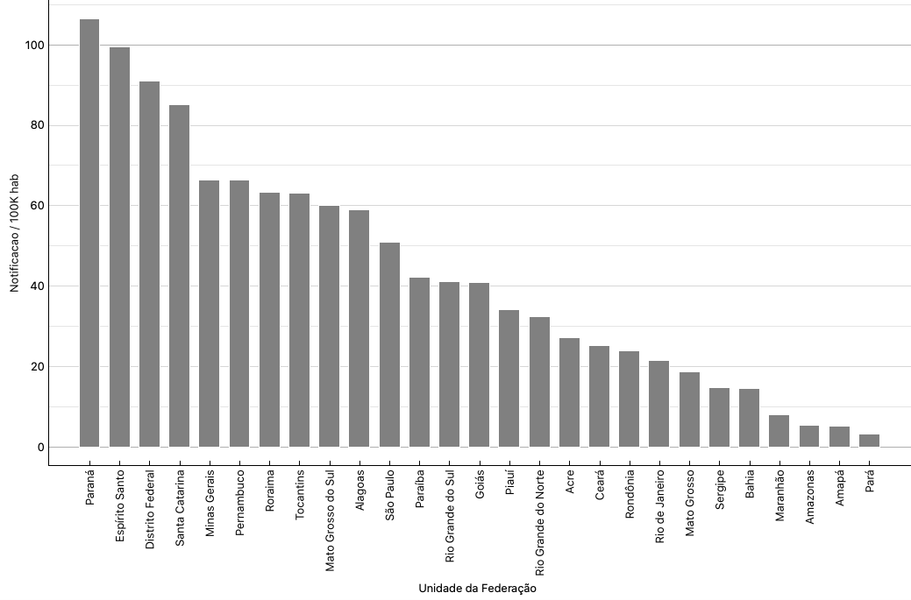

# Análises Realizadas
Primeiramente optamos por fazer um estudo sobre intoxicação por medicamentos e com base em dados do SINITOX, mantido pela Fiocruz. Observamos que esta base tem tido uma entrada cada vez menor de dados de notificações de intoxicação, o que acaba fazendo com que a mesma tenha uma tendência a não refletir a realidade tão bem como esperávamos. Por esta razão, optamos por não utilizá-la.

A alternativa foi coletarmos os dados da plataforma TabNet Win32 3.0, via site do DataSUS. Percebemos que aqui os dados são mais puros e precisam de uma pessoa da área de saúde cadastrada para preencher e realizar a notificação. Desta forma entendemos que estes dados são mais puros e fidedignos, sem uma tendência de manipulação ou perda.

Assim, pudemos escolher por região, agente tóxico e por ano, e com isso levantamos os dados desde 2008 até 2020. Os dados extraídos foram obtidos no formato CSV, visualizados no Excel e posteriormente tratados no PowerBI e no Orange para uma melhor análise e visualização gráfica dos mesmos.

## Evolução do projeto: problemas enfrentados e possíveis mudanças de trajetória. 
Dentre os problemas que enfrentamos, podemos citar o ato de baixar o programa TabWIN de 32 bits no computador para dar melhor visibilidade, o qual não conseguimos instalar e fazer uma melhor análise. Por causa disso, tivemos que coletar dados diretamente no site do DataSUS e posteriormente realizar uma limpeza dos dados como texto. Ao final das colunas e linhas, nas linhas e colunas sem dados utilizamos o valor “0”, como um dado nulo. Posteriormente, além da limpeza, ao começar a analisar os dados obtidos, realizando comparações entre regiões, sexo, idade, percebemos que não conseguiríamos apenas com estas bases analisar relações de proporcionalidade entre a quantidade de notificações por intoxicação e a quantidade de notificações por intoxicação por automedicação, e nem mesmo relacionar isto com propagandas, uma vez que os dados presentes nesta base referem-se apenas às notificações de intoxicação em si - sem especificar se estão atreladas a automedicação ou não. Observamos também que à medida que o SINITOX foi parando de ser alimentado, o SINAN começou a receber mais dados - uma indicação de que houve uma migração do SINITOX para o SINAN.

Outro problema que não há como levantar o tipo de medicamento ou a qual classe pertence, é um dado puro sobre intoxicação por medicamento, desta forma fica difícil determinar quais seriam os medicamentos que causam maior intoxicação ao qual poderia levar a uma conclusão melhor e desenvolver um trabalho de conscientização de automedicação, compreensão melhor porque determinado tipo de classe terapêutica  pode levar a intoxicação, se é um problema de auto consumo, falta de orientação, superdosagem ou qualquer outro problema relacionado.

Falta dados de classe terapêutica, falta dados se a causa foi tratada pelo SUS ou por hospital privado, falta dado do tipo escolaridade, falta dado do tipo medicamento aviado com prescrição médica ou sem prescrição ou se é da linha “OTC” ou medicamento isento de prescrição médica “MIP”.

A falta de uma base de dados relacionada à propaganda também nos impossibilitou de realizar análises e buscar relações entre as notificações por intoxicação / automedicação e a quantidade de propagandas / exposição na mídia de medicamentos específicos, que estavam nos nossos objetivos iniciais.

## Ferramentas
- Python / Orange;
- Ferramenta de controle de planilhas (Google Sheets);
- Git;
- Github;
- PowerBI

Aqui relata-se que tanto o Orange como o PowerBI são ferramentas excelentes para demonstrar graficamente estas análises, sendo que o Orange apresenta alguns recursos melhores de regressão linear e análise numérica em comparação ao PowerBI. Este por sua vez é melhor visualmente nos gráficos de mapa por região e tipos de gráficos de colunas e tabelas, assim como para realizar correlações. As duas ferramentas se complementam. No entanto, para fins de familiaridade com a natureza da ferramenta, o PowerBI, que é voltado para facilitar e abstrair qualquer necessidade de processamento para o usuário, foi a ferramenta que garantiu que os membros do grupo com pouca familiaridade com programação pudessem prosseguir com certa independência no projeto. O Orange permite maior customização de recursos e portanto permite uma variabilidade maior tanto nos aspectos de visualização quanto de processamento, além de permitir lidar com dados em formatações inadequadas, que não necessariamente seriam tratados pelo PowerBI.

# Resultados
Após realizar as análises mencionadas anteriormente, constatamos que o agente tóxico “medicamento”, realmente é o agente mais notificado como intoxicante em todas as regiões do Brasil como podemos notar abaixo **(Figura 7)**.

**Figura 7**. Análise causal do maior volume de notificações do SINAN

  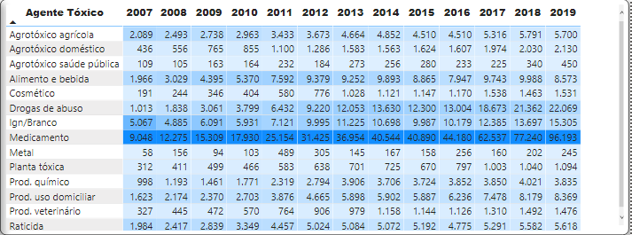

  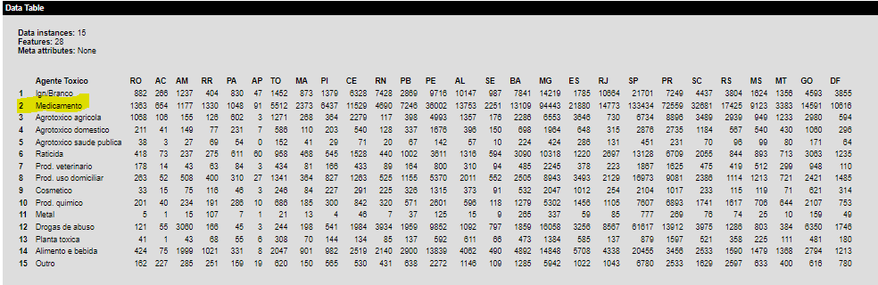

  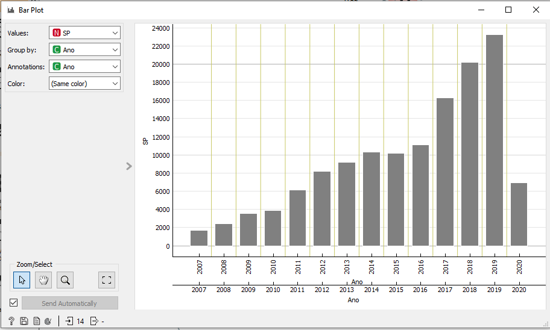

No processo de análise percebemos que há alguns estados com maior concentração de notificação como São Paulo, Minas Gerais e Paraná, seguido de Pernambuco e Santa Catarina com a mesma proporcionalidade **(Figura 8)**.

**Figura 8**. Resultado da separação dos dados de intoxicação por causa e Unidade Federativa

  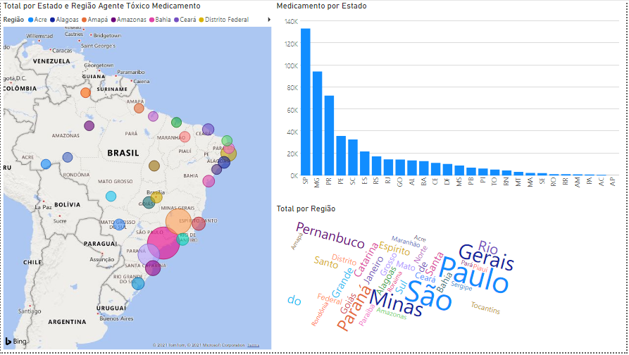

  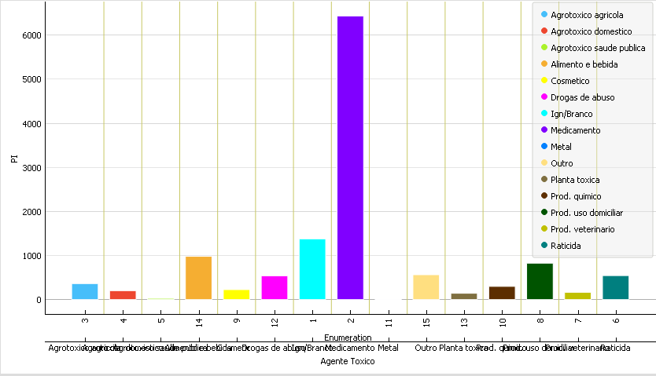

Uma outra análise realizada foi a proporção de notificações por cada 100 mil habitantes, desta forma percebemos que o estado de São Paulo apesar de possuir a maior quantidade de notificações, fica atrás do Paraná que é o estado com mais notificações por habitante **(Figura 6)**.

Aqui temos a relação de gastos entre hospital público e hospital privado em relação ao número de internações e gasto por internação **(Figura 9)**.

**Figura 9**. Relação de gastos de internação em hospitais públicos e privados em relação ao número de internações.

  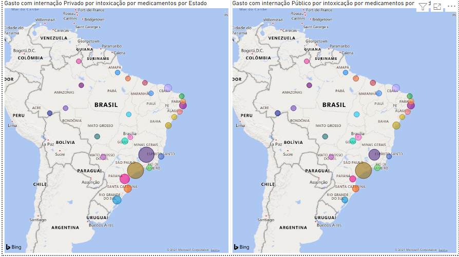

  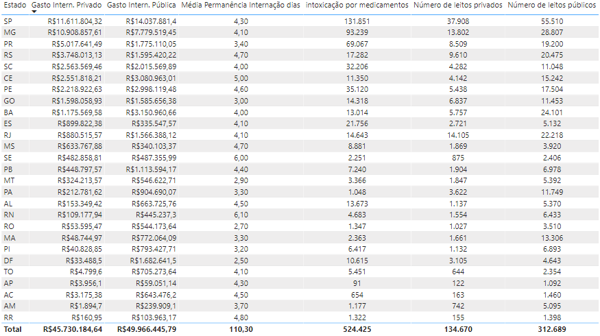

A média de internação é de 4 dias, com uma pequena variação até 5 dias, sendo que o número de leitos em hospital público é bem maior do que em relação ao hospital privado, sendo que também há uma procura bem maior pelo atendimento pelo SUS do que por convênios.

Nota-se que a ANVISA também faz uma rastreabilidade de reações adversas por medicamentos em seu site notivisa desde 2018 e que demonstra alto grau de reações por vários tipos de medicamentos, principalmente a dipirona sódica, cujo medicamento é isento de prescrição médica e com alto grau de consumo como analgésico e antipirético.

Um resumo dos resultados encontrados pode ainda ser visualizado neste link: https://bit.ly/ResultadosDataSci4Health

# Discussão
Discussão realizada em conjunto com a seção de Resultados.

# Conclusão
No SINAN, o número de notificações de intoxicações por uso de medicamentos é maior do que o de qualquer outro agente. Ao analisar as notificações de intoxicação por uso de medicamentos por estado ao longo do tempo, nota-se que o número de notificações aumenta de forma coordenada entre os estados, porém apresenta aumento significativo a partir de 2018. Apesar do estado de São Paulo apresentar maior número de notificações de intoxicação por uso de medicamentos, o Paraná é o estado com maior número de notificações para cada 100 mil habitantes. Analisando os dados de 2019, nota-se a correlação moderada positiva entre a renda per capita e as notificações de intoxicação por uso de medicamentos para 100 mil habitantes. 

## Principais desafios enfrentados
A falta de uma base com dados sobre automedicação no Brasil ao longo dos anos, impossibilitou uma análise mais profunda sobre a relação entre os dados de intoxicação por uso de medicamentos e a automedicação.

Utilizamos a projeção do IBGE para capturar os dados sobre número de habitantes por estado no Brasil no ano de 2019, uma vez que o último censo foi realizado em 2010. Foi utilizada a renda per capita do IBGE por estado em 2019, uma vez que os dados de notificação não possuem dados de renda, o que impossibilitou a execução da regressão. 

O problema dos dados do IBGE é que foi necessário uma fase de entendimento dos conceitos e termos relacionados, uma vez que o volume de dados é muito grande e estão organizados por terminologias técnicas muito específicas, o que dificultou por exemplo, determinar o grau de escolaridade de um determinado estado.

## Principais lições aprendidas
A qualidade e quantidade de dados é um fator fundamental para fazer uma análise mais completa das perguntas a serem respondidas. Por exemplo, como os dados de notificação não possuem o dado de automedicação, não conseguimos fazer a correlação. Com isso estudamos somente os dados de notificação de intoxicação por uso de medicamentos.

# Trabalhos Futuros
Investigar quais os fatores que estão causando o aumento de notificações de intoxicação por uso de medicamentos. Seguem algumas hipóteses abaixo.

O aumento de notificações de intoxicação por uso de medicamentos pode ser explicado devido:
- Ao aumento do uso do sistema do SINAN pelos médicos?
- Ao aumento do uso do sistema do SINAN em hospitais?
- Ao aumento de casos reais?

As hipóteses acima não são excludentes, as três podem explicar uma parcela do aumento de notificações. Outro ponto a ser estudado é a influência de fatores que levam a intoxicação, como propaganda de medicamentos e automedicação, nos número de notificações. Mais um estudo futuro poderia ser a explicação do por que existe correlação moderada positiva entre a renda per capita nos estados e o número de notificações por habitantes.

Algumas hipóteses são:
- O poder aquisitivo influencia a quantidade de aquisição e consumo de medicamentos?
- Os estados com maior renda acessam o SINAN com mais facilidade?
- A população de estados com maior renda têm maior probabilidade de ir ao hospital em caso de intoxicação?

# Referências Bibliográficas
[1]  Conselho Federal de Farmácia, Pesquisa aponta que 77% dos brasileiros têm o hábito de se automedicar. Disponível em: https://crfsp.org.br/noticias/10535-pesquisa-aponta-que-77-dos-brasileiros-t%C3%AAm-o-h%C3%A1bito-de-se-automedicar.html. Acesso em Junho/2021

[2] LABOISSIÈRE, P. ONU: uso excessivo de remédios pode matar 10 milhões ao ano até 2050. Disponível em: https://agenciabrasil.ebc.com.br/saude/noticia/2019-04/onu-uso-excessivo-de-remedios-pode-matar-10-milhoes-ao-ano-ate-2050. Acesso em Junho de 2021.

[3] MELO, J. R. R. et al. Automedicação e uso indiscriminado de medicamentos durante a pandemia da COVID-19. Cad. Saúde Pública, 1999. Disponível em: https://www.scielo.br/j/csp/a/tTzxtM86YwzCwBGnVBHKmrQ/?format=html. Acesso em Junho/2021
 
[4] FERREIRA, I. S. & CARVALHO, C. J. S. A influência da propaganda de medicamentos na prática da automedicação: um problema de saúde pública. Brazilian Journal of Development, 2021. Disponível em: https://www.brazilianjournals.com/index.php/BRJD/article/view/29676/23396.Junho/2021

[5] FERREIRA, F. C. et al. O impacto da prática da automedicação no Brasil: Revisão Sistemática. Brazilian Applied Science Review, 2021. Disponível em:  https://www.brazilianjournals.com/index.php/BASR/article/view/31242. Acesso em Junho/2021
 

[6] Uso de medicamentos. Abril/2019. Conselho Federal de Farmácia. Instituto de Pesquisa Datafolha. Disponível em: https://www.cff.org.br/userfiles/file/Uso%20de%20Medicamentos%20-%20Relat%c3%b3rio%20_final.pdf. Acesso em Junho/2021.

[7] Rendimento Domiciliar per capita por estado no Brasil em 2019. Disponível em:
https://agenciadenoticias.ibge.gov.br/agencia-sala-de-imprensa/2013-agencia-de-noticias/releases/26956-ibge-divulga-o-rendimento-domiciliar-per-capita-2019. Acesso em Junho/2021.
