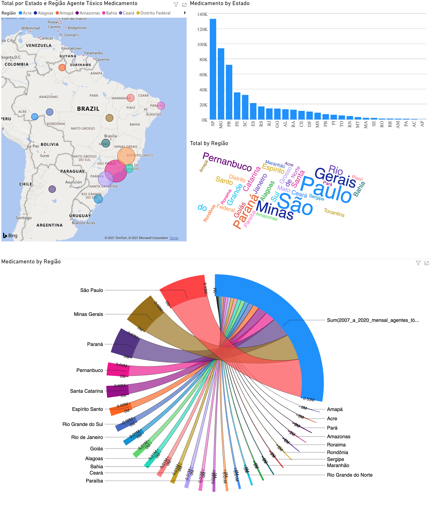

# Projeto `Uma análise sobre a quantidade de notificações por intoxicação com medicamentos`
# Project `An analysis of the number of notifications for drug intoxication`

# Apresentação

O presente projeto foi originado no contexto das atividades da disciplina de pós-graduação [*Ciência e Visualização de Dados em Saúde*](https://github.com/datasci4health/home), oferecida no primeiro semestre de 2021, na Unicamp. Segue a relação dos integrantes do grupo e respectivas áreas de especialização.

|Nome  | RA | Especialização|
|--|--|--|
| Alline Dias de Araujo  | 234988  | Computação|
| Bernardo do Amaral Teodosio  | 167494  | Computação|
| Marcelo Gorri Mazzali  | 107551  | Saúde|
| Moníze Valéria Ramos da Silva  | 184731  | Saúde|
| Rodolfo Dalla Costa  | 228956  | Computação|

# Descrição Resumida do Projeto
Na segunda década do século XXI foi possível perceber um aumento substancial no número de casos notificados de intoxicação por medicamentos, perfazendo a marca de 500.000 casos de intoxicações no SINAN. Tais dados apontam para uma maior incidência de casos de intoxicação medicamentosa do que por agrotóxicos, conforme pesquisa feita pelo grupo na mencionada base de dados. O achado em questão é coerente com o que vem sendo observado por órgãos como a Organização das Nações Unidas, por exemplo. Tratam-se de previsões sombrias e alarmantes que infelizmente são coerentes com os dados do estudo na população brasileira em 2019. Esta pesquisa de 2019 apontou ainda que as principais classes medicamentosas associadas à automedicação são: analgésicos e relaxantes musculares, com destaque para a dipirona como medicamento mais consumido nesse contexto. Além desse panorama, cabe destacar a grande variabilidade entre as cinco regiões brasileiras, tanto do ponto de vista socioeconômico quanto às notificações de intoxicações. Desta forma, o grupo se interessou em analisar estes tópicos, partindo desde análises dos perfis socioeconômicos e de faixa etária dos indivíduos afetados  das regiões brasileiras, procurando correlacionar os mesmos com a incidência de intoxicações medicamentosas. Para tanto, foram analisados dados presentes nas bases de dados públicas SINAN (Sistema Nacional de Agravos de Notificação) e IBGE, analisados com auxílio de ferramentas como o Power Bi, Orange e Collab. As análises realizadas apontaram para uma maior quantidade de notificações de intoxicação medicamentosa no estado do Paraná, após normalização pelo número estimado de habitantes. Além disso, foi possível notar uma correlação positiva entre número de notificações e renda, bem como uma maior quantidade de notificações em indivíduos adultos, quando comparado com outras faixas etárias mais extremas.
  
# Vídeos do Projeto

## Vídeo da Proposta
O vídeo da proposta do projeto pode ser encontrado no link a seguir: https://youtu.be/Dt77q7QpOvs

## Vídeo da Apresentação Final
O vídeo da apresentação final do projeto pode ser encontrado no link a seguir: https://youtu.be/2BDkJIeEiB4

# Slides do Projeto

## Slides da Proposta
Os slides da proposta original do projeto podem ser encontrados aqui: https://github.com/berteodosio/datascience4health/blob/master/assets/slides-proposta.pdf

## Slides da Apresentação Final
Os slides da apresentação final do projeto estão disponíveis em:
https://docs.google.com/presentation/d/e/2PACX-1vSbvtTkR4ttn-mb_54xGK2dKQIzksI9xq-47L0eMnpazRe4zRLiyh1QhYonAJVwe5-oEH6GwT53igcn/pub?start=false&loop=false&delayms=3000

# Perguntas de Pesquisa
1. Qual a relação entre a quantidade de notificações por intoxicação e a quantidade de intoxicações por automedicação na população brasileira?
1. Qual a relação entre a quantidade de notificações de intoxicações por automedicação e o poder socioeconômico das regiões brasileiras?
1. Qual o perfil socioeconômico da população brasileira que realiza notificações sobre intoxicações epidemiológicas?

A Análise Exploratória contribuiu para que possamos nos aproximar das respostas das Perguntas de Pesquisa. Optamos por subdividir os resultados da Análise de acordo com as perguntas que a mesma ajuda a responder.

# Metodologia
Acreditamos que utilizaremos análises estatística e temporal, usando técnicas como regressão linear para explorar os dados obtidos. Pretendemos seguir a metodologia KDD durante todo o processo de desenvolvimento do projeto.

## Bases de Dados e Evolução

### Bases Estudadas mas Não Adotadas

|Base de Dados  | Endereço na Web | Resumo descritivo|
|--|--|--|
| SINITOX  | https://sinitox.icict.fiocruz.br/  | Base de dados mantida pela Fiocruz que contém dados de notificação de intoxicação|

Apesar da base ainda ser mantida pela Fiocruz, a mesma tem tido uma entrada cada vez menor de dados de notificações de intoxicação, o que acaba fazendo com que a base tenha uma tendência a não refletir a realidade tão bem. Por esta razão, optamos por não utilizá-la.

|Base de Dados  | Endereço na Web | Resumo descritivo|
|--|--|--|
| AEL / IBOPE  | https://www.ael.ifch.unicamp.br/ | Base de arquivos digitalizados provenientes de diversas fontes, incluindo o IBOPE|

Esta base não foi utilizada primariamente porque, após acessá-la, constatamos que seus dados estavam em forma de arquivos digitalizados - isto é, os dados presentes na mesma eram imagens de folhas de papel preenchidas. Sendo assim, não conseguiríamos extrair informações úteis ao nosso trabalho utilizando a mesma, e por isso optamos por não seguir adiante com análises em cima da mesma.

### Bases Estudadas e Adotadas

|Base de Dados  | Endereço na Web | Resumo descritivo|
|--|--|--|
| SINAN  | https://portalsinan.saude.gov.br/ | Base alimentada pela notificação e investigação de casos de doenças, a nível nacional|

A base, que faz parte do DATASUS, tem uma entrada de dados de notificações de intoxicação muito boa, possui diversas classificações, o que permite que seja possível comparar o tipo de intoxicação desejada por outros tipos, além de permitir o agrupamento dos dados por gênero, regionalidade, faixa etária e ser constantemente atualizada.

|Base de Dados  | Endereço na Web | Resumo descritivo|
|--|--|--|
| IBGE  | https://www.ibge.gov.br/estatisticas/sociais/educacao/9662-censo-demografico-2010.html | Base de dados obtidos pelo Instituto Brasileiro de Geografia e Estatística, compreendendo desde dados de censos  e PNS.|

A base do IBGE exige uma busca pelo estudo estatístico adequado para que a base possa ser cruzada com os dados existentes, no entanto, a base do IBGE é quem fornece a fonte de dados mais completa a respeito das condições socioeconômicas por gênero, microrregiões, Unidade Federal, faixa etária e grau de escolaridade.

### Integração entre bases e Análise Exploratória

A análise exploratória foi realizada principalmente com o auxílio das ferramentas PowerBI e Orange. Optamos por dividir a análise em partes, segundo as Perguntas de Pesquisa que temos a pretensão de responder com o nosso projeto. Originalmente, nosso projeto possuía quatro perguntas de pesquisa - decidimos remover a última - "Qual o impacto das campanhas publicitárias na decisão dos brasileiros em se automedicar?" por não encontrarmos bases de dados com dados de campanhas publicitárias que poderíamos utilizar para cruzar com os dados que temos de intoxicação.

**Pergunta: Qual a relação entre a quantidade de notificações por intoxicação e a quantidade de intoxicações por automedicação na população brasileira?**

Não conseguimos relacionar nossos dados com quantidade por automedicação de maneira direta, pois não há base de dados sobre automedicação no Brasil, mas optamos que que a partir de 2007 até 2019 há um alto índice de intoxicação pelo “agente tóxico” medicamento, quando comparado aos demais agentes como drogas de abuso, defensivo agrícola, entre outros, conforme demonstrado pela relação abaixo por ano -  o que sugere se tratar de casos de intoxicação medicamentosa. A Figura 1 apresenta uma síntese das análises dos dados do SINAN associados às intoxicações.

**Figura 1**. Resultado quantitativo do levantamento de dados associados à intoxicação do SINAN.

  

Através desta avaliação podemos concluir que o agente tóxico medicamento é o que mais vem sendo notificado em relação aos demais por ano e crescendo ano a ano desde 2007. Partindo destes resultados, realizamos uma segunda análise para verificar a procedência desse montante de notificações. Assim, verificamos que a maioria das notificações é proveniente dos estados de São Paulo, Minas Gerais e Paraná. Notamos ainda que, curiosamente, Pernambuco e Santa Catarina apresentam um índice de notificações bem próximas conforme é possível observar nos gráficos abaixo (Figura 2):

**Figura 2**. Resultado da separação dos dados de intoxicação causadas por medicamento por Unidade Federativa

  

**Pergunta: Qual a relação entre a quantidade de notificações de intoxicações por automedicação e o poder socioeconômico das regiões brasileiras?**

Não foi possível avaliar por este critério de automedicação conforme justificado acima, mas agora podemos levantar outros questionamentos: por que três estados especificamente têm o maior índice de notificações? Existe alguma relação entre estes estados ou trata-se do mero acaso no caso de Pernambuco e Santa Catarina apresentarem dados próximos? A quantidade de hospitais por estado brasileiro e se possível a concentração dos mesmos em relação às regiões mais habitadas - estes números podem impactar grandemente nos resultados de nossas análises preliminares. Além disso, uma maior procura de pessoas para realizar notificações ou para dar entrada em hospitais por intoxicação devido a dificuldades de acesso em determinadas regiões também impactaria. Temos ainda questionamento sobre uma possível relação entre o que pretendemos cruzar com informações provenientes do IBGE e do site da Receita Federal relacionando a quantidade de hospitais, de forma a tentar encontrar padrões que ajudem a responder estes questionamento, bem como buscar por possíveis correlações de cunho sócio-econômico.

**Pergunta: Qual o perfil socioeconômico da população brasileira que realiza notificações sobre intoxicações epidemiológicas?**

No SINAN, não existe uma relação epidemiológica ligada diretamente à condição sócio econômica, mas podemos verificar pelo IBGE e por região quais as condições de renda e fazer uma correlação e verificar este fato. Salientamos que a análise em questão será realizada num próximo passo de avaliação de dados. Uma segunda etapa em relação a este perfil de análise seria fazer uma avaliação por faixa etária, onde já constatamos que há uma relação forte entre a faixa de 29 a 59 anos (Figura 3) como sujeitos das notificações levantadas. 

**Figura 3**. Resultado da separação dos dados de intoxicação por medicamento de acordo com a faixa etária do sujeito da notificação.

  

Como podemos notar nos gráficos gerados acima, estados com maior população como São Paulo e Minas Gerais possuem mais notificações de intoxicação. Para uma analise mais precisa verificamos a quantidade de notificações por habitantes. O gráfico abaixo mostra esta relação com a quantidade de notificações para um grupo de 100 mil habitantes por estado. Os dados populacionais foram obtidos na projeção do IBGE para o ano de 2019. 

  

# Ferramentas
- Python / Orange;
- Ferramenta de controle de planilhas (Google Sheets);
- Git;
- Github;
- Tableau.
- PowerBI

# Cronograma
- Até o final de Abril - Consolidação das bases de dados a serem utilizadas; Definição das perguntas de pesquisa a serem utilizadas;
- Até o final de Maio - Consolidação de artigos / parte estatística dos bancos
- Meados de Junho - Finalização da escrita do relatório final
